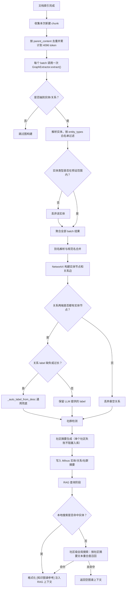

# 知识图谱进度管理

## 文档目的

这份文档用于跟踪知识图谱功能的建设进度，包含：

- 当前已经完成的能力
- 待完成清单与优先级
- 每个任务的验收标准
- 后续更新进度时应该维护哪些字段
- 当前风险和下一步工作

## 知识图谱构建与关系标签兜底流程



补充：`_auto_label_from_desc` 的实际调用点有三个：旧格式关系解析、NetworkX 建图兜底、Milvus 写入兜底；上图用“关系 label 缺失或过长”概括后两处。

## 当前状态快照

- 状态：实验功能已基本串联，尚未达到生产可用
- 主入口：`qa_core/knowledge_graph/pipeline.py`
- 已接入位置：文档入库后自动触发构建；RAG 回答准备阶段追加图谱上下文
- 最近变更：知识图谱抽取改为按 `parent_content` 去重后按 4096 token 分批，每个 batch 调用一次 LLM 抽取
- 最近变更：新增实体类型白名单，解析阶段会丢弃预设 `entity_types` 之外的实体
- 最近变更：关系标签兜底去掉斗破硬编码，改为通用中文关系规则
- 最近变更：关系短标签接入图 API 网页显示链路
- 最近变更：新增社区摘要生成与社区级全局搜索，本地搜索无实体命中时回退社区检索
- 测试结果（2026-08-04）：
  - 新增分批测试：`tests/test_kg_parent_batching.py` 4 passed
  - 新增类型范围测试：`tests/test_kg_extractor_scope.py` 3 passed
  - 新增通用标签测试：`tests/test_kg_auto_label.py` 4 passed
  - 新增社区搜索测试：`tests/test_kg_community_search.py` 5 passed
  - 全量测试：162 passed，3 failed（新增 5 个知识图谱社区搜索测试后）
  - 3 个失败用例为意图仲裁、意图策略校准、MySQL 元数据可见性窗口，与本次知识图谱改造无直接代码路径关系，仍需单独回归

## 已完成

| 编号 | 能力 | 说明 | 完成依据 |
|------|------|------|----------|
| DONE-01 | 实体/关系抽取 | LLM 主抽取、多轮 gleaning、结构化解析、旧格式兼容 | `qa_core/knowledge_graph/extractor.py` |
| DONE-02 | 抽取提示词 | 中文实体/关系抽取提示，支持 6 字段关系格式 | `qa_core/knowledge_graph/prompts.py` |
| DONE-03 | 别名解析 | 字符级相似度、联通分量、规范名合并、关系重定向 | `qa_core/knowledge_graph/pipeline.py` |
| DONE-04 | 图构建 | NetworkX 建图，Leiden/Louvain 社群检测与回退 | `qa_core/knowledge_graph/graph_builder.py` |
| DONE-05 | Milvus 存储 | 实体、关系、社群三集合，含 `kb_version` 元数据 | `qa_core/knowledge_graph/storage.py` |
| DONE-06 | 本地检索 | 实体 token 匹配、图遍历、关系排序、格式化上下文 | `qa_core/knowledge_graph/local_search.py` |
| DONE-07 | RAG 集成 | 回答准备阶段注入 `[知识图谱参考]` | `qa_core/pipeline/steps.py` |
| DONE-08 | 图查询 API | 实体模糊查询、关系展开、实体详情、可视化页 | `qa_core/api/graph.py` |
| DONE-09 | parent 分批抽取 | 优先 `parent_content`，按 `parent_id` 去重，按 token 累计 | `qa_core/knowledge_graph/pipeline.py` |
| DONE-10 | 分批单测 | 覆盖 parent 去重、回退、token 分批、每 batch 一次抽取 | `tests/test_kg_parent_batching.py` |
| DONE-11 | 实体类型白名单 | 解析阶段丢弃预设 `entity_types` 之外的实体，建图阶段丢弃悬空关系 | `qa_core/knowledge_graph/extractor.py`、`tests/test_kg_extractor_scope.py` |
| DONE-12 | 通用关系标签兜底 | 移除斗破硬编码，改用通用中文关系规则；storage 复用 extractor 实现 | `qa_core/knowledge_graph/extractor.py`、`qa_core/knowledge_graph/storage.py`、`tests/test_kg_auto_label.py` |
| DONE-13 | 网页图显示短标签 | 图 API 边标签优先显示 `label`，RAG 本地搜索不读取该字段 | `qa_core/api/graph.py` |
| DONE-14 | 社群摘要生成 | 构建阶段为每个社区生成中文摘要并写入 `kg_communities` | `qa_core/knowledge_graph/community_search.py`、`qa_core/knowledge_graph/prompts.py` |
| DONE-15 | 社区级全局搜索 | 按社区摘要相关性召回并格式化为 `[社区知识参考]`，RAG 本地无实体命中时回退 | `qa_core/knowledge_graph/community_search.py`、`qa_core/knowledge_graph/retrieval_integration.py`、`tests/test_kg_community_search.py` |

## 待完成清单

| 编号 | 任务 | 优先级 | 状态 | 说明 | 验收标准 |
|------|------|--------|------|------|----------|
| KG-01 | 真实数据端到端验收 | P0 | 待开始 | 用真实场景文档跑完整构建，检查 batch 数、token、实体/关系数量和入库结果 | 日志出现批次/token 信息；Milvus 三集合有数据；无重复实体/关系；RAG 能追加图谱上下文 |
| KG-02 | 实体描述向量真正生成 | P0 | 待开始 | 当前 `description_vector` 写的是全 0 向量，语义向量检索不可用 | 实体写入前用 embedding 生成向量；向量非零；可按语义召回实体 |
| KG-03 | 版本/租户/数据集隔离 | P0 | 待开始 | `local_search`、`global_search`、图 API 未过滤 `kb_version` 和 `DataScope` | 只查当前激活版本；不同租户/数据集互不可见；旧版本不污染新版本 |
| KG-04 | 检索表达式安全过滤 | P0 | 待开始 | `name like "%{}%"`、`source == "{}"` 直接拼接用户输入 | 特殊字符被转义；无法通过 query 注入过滤表达式 |
| KG-05 | 社群摘要生成 | P1 | 已完成 | 构建阶段生成中文摘要并写入 `kg_communities` | 每个社群生成摘要并写入 `kg_communities`；摘要包含核心实体和关系 |
| KG-06 | 社群级全局检索 | P1 | 已完成 | 本地搜索无实体命中时回退到社区摘要检索 | 支持按社群摘要召回；全局/模糊问题能返回综合答案 |
| KG-07 | 图谱检索置信度 | P1 | 待开始 | RAG 集成只是把 `hit_type` 改成 `graph_context`，没有图谱分数和置信度 | Trace 中包含图谱命中实体数、关系数、分数；置信度计算有独立分支 |
| KG-08 | 幂等入库与版本清理 | P1 | 待开始 | 重建同一版本可能重复插入，需要删除旧图或使用确定性 ID/upsert | 同一 `kb_version` 重复构建不产生重复实体/关系 |
| KG-09 | 测试覆盖补全 | P1 | 进行中 | 已有 parent 分批测试；还缺抽取、别名、图构建、存储、local search、RAG 集成测试 | 所有知识图谱核心函数有单测；真实 Milvus/LLM 有可重复的 e2e 测试 |
| KG-10 | 图谱配置下沉 | P2 | 待开始 | `4096`、实体类型、gleaning、社群算法等目前偏硬编码 | 场景配置或 settings 可配置 `max_tokens`、实体类型、是否启用图谱 |
| KG-11 | 文档同步 | P2 | 待开始 | `docs/knowledge-graph-practice.md` 仍写 `batch_size=10`，架构图仍写每 chunk 一次抽取 | 实践文档与本代码一致；进度文档被项目文档引用 |
| KG-12 | 构建观测与统计 | P2 | 待开始 | 缺少构建耗时、token 用量、批次失败率、图谱检索命中率指标 | 能通过日志或管理接口看到最近一次构建摘要和错误 |
| KG-13 | 失败恢复与成本控制 | P2 | 待开始 | 单个 batch 失败只记录错误，没有重试、降级或成本统计 | 对 LLM 失败有明确策略；token 用量和抽取成本可统计 |
| KG-14 | 入库调用健壮性 | P2 | 待开始 | 入库链路直接调用图谱构建，异常只打 warning，缺少重试和阻塞策略 | 图谱构建失败不影响主文档入库；不会重复初始化或阻塞事件循环 |

## 当前冲刺重点

下一阶段先做 P0，目标是让知识图谱从“能跑”变成“能安全、可靠地进生产”：

1. KG-01：真实场景端到端验证，确认分批和抽取效果
2. KG-02：实体向量生成，让图谱具备语义检索能力
3. KG-03：版本/租户/数据集隔离，避免数据串用
4. KG-04：检索表达式安全过滤，避免注入和异常

P0 完成后，继续推进 KG-07，把图谱/社区检索置信度补上。

## 进度更新规则

每次完成一个任务时，按以下步骤更新：

1. 把“待完成清单”中对应任务的状态改为“已完成”
2. 在“已完成”表追加一行，写明完成依据，例如文件路径、测试结果或运行日志
3. 更新“当前状态快照”的测试结果和最近变更
4. 如果出现新风险，在“风险登记”中追加一条
5. 如果任务优先级变化，更新表格中的优先级并写明原因

## 风险登记

| 风险 | 影响 | 当前状态 | 缓解方式 |
|------|------|----------|----------|
| 实体向量为全 0 | 图谱语义检索无效 | 未解决 | KG-02 |
| 没有版本/数据域过滤（local_search、global_search、图 API） | 旧版本或跨租户数据可能被检索到 | 未解决 | KG-03 |
| Milvus expr 直接拼接用户输入 | 注入或查询失败 | 未解决 | KG-04 |
| 社区检索无语义向量 | 全局问题近义表达命中弱 | 未解决 | 后续为社区摘要生成向量或使用 LLM map-reduce 汇总 |
| 全量测试有 3 个失败 | 无法确认完整回归绿色 | 待排查 | 单独排查意图策略和 MySQL 元数据用例 |
| 实践文档与代码不一致 | 误导后续开发 | 未解决 | KG-11 |

## 验证命令

在 conda `nanobot` 环境运行：

```bash
/home/huhu/miniconda3/envs/nanobot/bin/python -m pytest tests/test_kg_parent_batching.py -q
/home/huhu/miniconda3/envs/nanobot/bin/python -m pytest -q
```

真实链路验证入口：

```bash
/home/huhu/miniconda3/envs/nanobot/bin/python tests/test_kg_e2e.py
```
